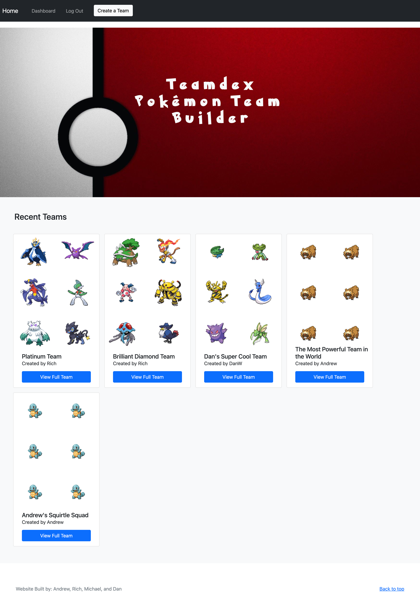

# Team Dex
[](./LICENSE)
## Description
This is a pokemon team building app where you can pick pokemon based on which game you are playing. Built with Express, MySQL2, Sequelize, and Handlebars.

## User Story
```
As a fan of the Pokemon series, I want a tool for finding and storing the info on Pokemon I want to use so that I can plan a team that is a good fit for the specific game I want to play.
```

## Table of Contents
- [Installation](#installation)
- [Usage](#usage)
- [Link](#link)
- [Collaborators](#collaborators)
- [License](#license)
- [Features](#features)
- [Tests](#tests)

## Installation
- To get the app on your local machine:
  1. Click on the code button on the repo.
  2. Copy the HTTPS or SSH link.
  3. Run the command `git clone` with the copied HTTPS or SSH link.
- To get the app prepared to run:
  1. In your local repo, make a `.env` file and enter the follow text with your own credentials.
    ```
    DB_NAME=teamdex_db
    DB_PASSWORD=YOUR PASSWORD HERE
    DB_USER=root
    SESSION_SECRET='YOUR SECRET KEY HERE'
    HOST=localhost
    ```
  2. In the terminal, run the command `npm i`, then run `mysql -u root -p`.
  3. After logging into MySQL, run the command `source db/schema.sql`, then run `quit`.
- If you would like seed data for testing, run the command `npm run seed`.

## Usage
The visual shows the app running on a deployed heroku server.



## Deployed Link
https://teamdex.herokuapp.com/

## Collaborators
Michael Hranek - GitHub: [MHranek](https://github.com/MHranek)

Rich Kaplan - GitHub: [rykaplan1](https://github.com/rykaplan1)

Daniel Westiner - GitHub: [DanielWestiner](https://github.com/DanielWestiner)

Andrew Yoo - GitHub: [andrewbyoo](https://github.com/andrewbyoo)

## License
This application is covered under the MIT license.

## Features
- View the 10 most recently made teams
- Create a login that holds user team data
- Select pokemon for your teams based on the game being played
- Save created teams to be viewed on the user dashboard
